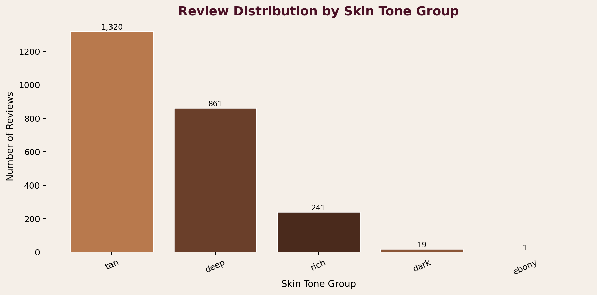
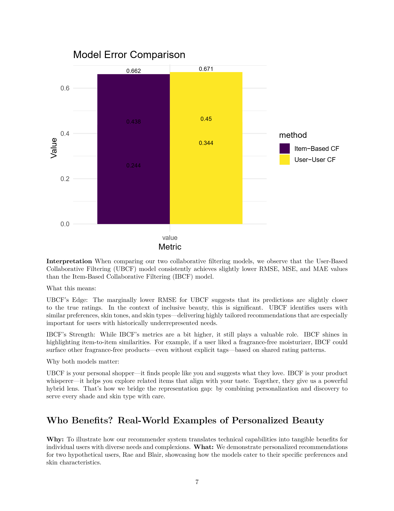
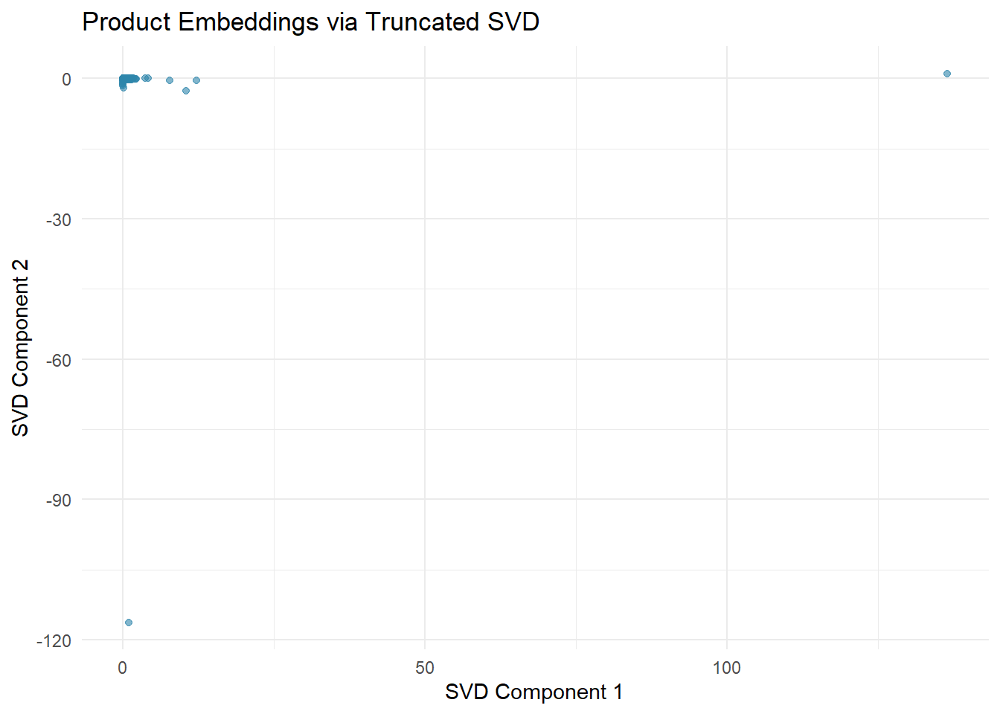
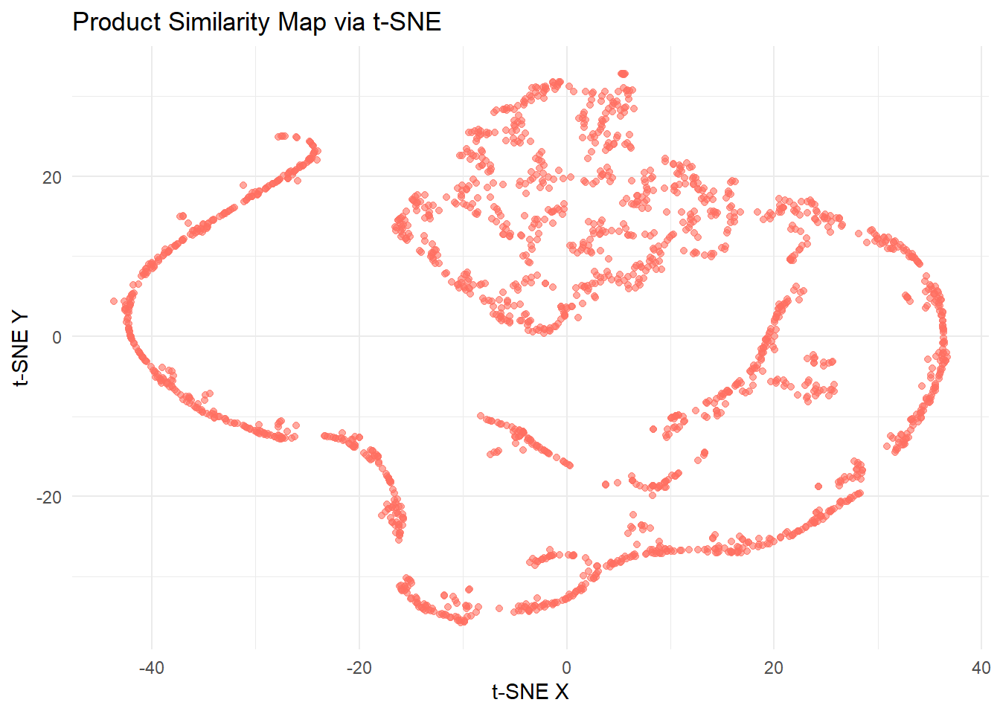
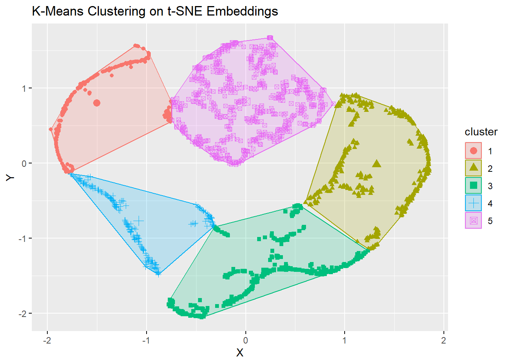
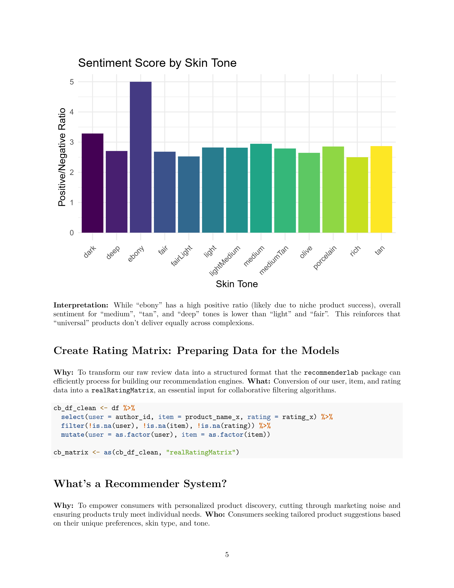
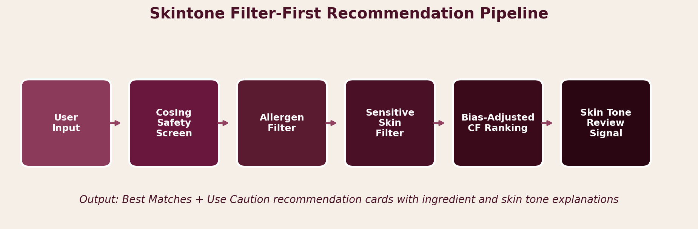
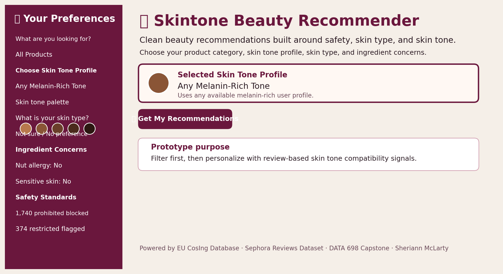
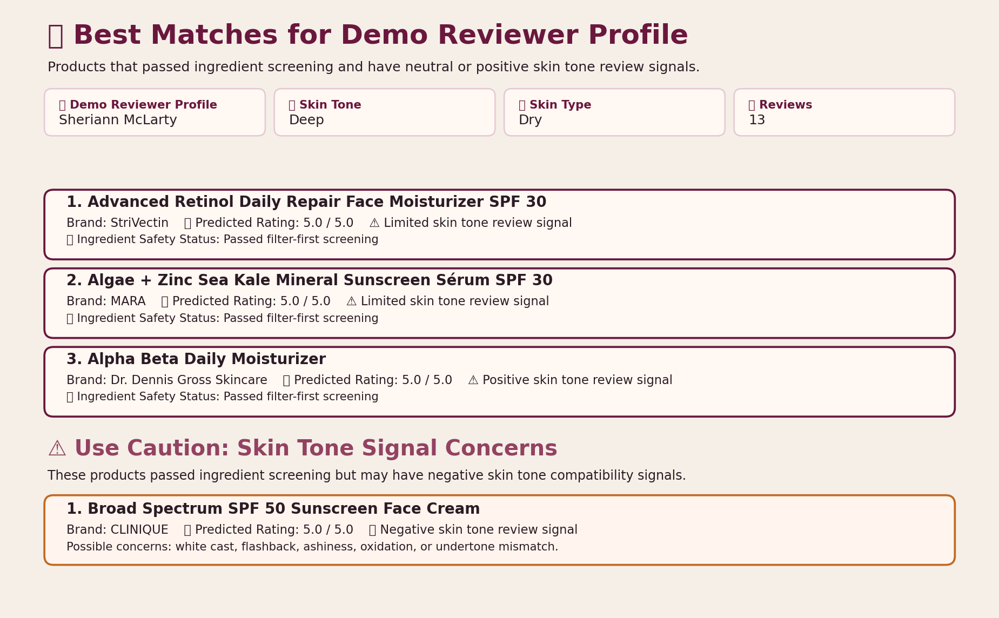
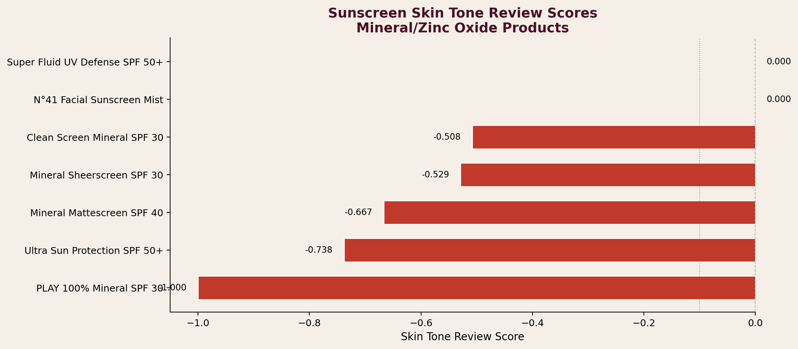

```{=html}
<style>
body { line-height: 1.55; }
.figure-fallback {
  border: 1px dashed #b58ca0;
  background: #fff8f3;
  color: #4a1025;
  padding: 1rem;
  border-radius: 12px;
  margin: 1rem 0;
}
</style>
```

## Abstract

This capstone presents **Skintone Beauty Recommender**, a safety-constrained hybrid clean beauty recommender system designed to support ingredient safety, skin type needs, skin tone compatibility, and personalized product ranking for melanin-rich users. Traditional beauty recommendation systems often prioritize average ratings, popularity, or general engagement. Those signals are useful, but they do not fully answer the questions that matter in beauty: whether a product contains ingredients of concern, whether it fits a user's skin type, and whether it performs well across deeper skin tones.

Skintone combines a bias-adjusted collaborative filtering model with a filter-first recommendation pipeline. The system includes EU CosIng ingredient screening, nut allergen detection, sensitive skin and eczema screening based on review language, skin type preference ranking, and review-based Skin Tone Review Signals. The final prototype was implemented as a Streamlit application using Sephora review data, product metadata, and EU CosIng ingredient safety references. The local app successfully demonstrated how recommendation systems can move beyond ratings by making safety, skin type, and skin tone compatibility visible in the recommendation output.

---

## 1. Introduction

Beauty recommendation systems are often presented as neutral ranking tools that surface top products based on ratings or similar-user behavior. However, beauty products interact directly with the skin. A highly rated product can still be irritating, incompatible with a user's skin type, or visibly poor on deeper skin tones.

For melanin-rich users, product performance can vary because of undertone mismatch, oxidation, flashback, white cast, ashiness, or lack of shade inclusivity. These issues are not always captured in star ratings. A product may have a high average rating and still fail a specific group of users.

At the same time, cosmetic ingredient safety standards vary across regulatory systems. The European Union's CosIng database includes thousands of prohibited and restricted substances, while United States cosmetic regulation has historically been less restrictive. This creates a need for tools that help users evaluate products before relying on popularity-based recommendations.

Skintone was built to address this gap. The goal was to design a recommender that does not simply ask, "What product is highly rated?" Instead, it asks:

> Is this product safe according to ingredient constraints, suitable for the user's skin type, and likely to work on the selected skin tone profile?

---

## 2. Problem Statement

Generic beauty recommenders rely too heavily on average ratings and popularity while ignoring three important dimensions:

1. **Ingredient safety**
2. **Skin type needs**
3. **Visible performance across skin tones**

A product can be popular and still contain an ingredient of concern. A product can pass ingredient screening and still leave a white cast or flashback on deeper skin tones. A product can work well for one skin type and still be too heavy, drying, or irritating for another.

The problem is not only technical. It is also about representation. If review datasets contain fewer interactions for richer and ebony skin tone groups, the recommender has less information available for personalization. Skintone uses this limitation as part of the research, not something to hide.

---

## 3. Research Questions and Hypotheses

Three research questions guided the design and evaluation of the Skintone prototype.

**RQ1:** Can ingredient safety constraints be applied while still producing useful recommendations?

> **H1:** A filter-first safety layer can reduce ingredient safety risk before personalization is applied.

**RQ2:** Can review-based skin tone signals support skin tone compatibility ranking?

> **H2:** Review language related to white cast, flashback, ashiness, oxidation, and positive match terms can provide a useful proxy for skin tone compatibility.

**RQ3:** What tradeoff appears between strict filtering, representation, and personalization coverage?

> **H3:** Coverage decreases as constraints increase, but the remaining recommendations are more aligned with user safety and compatibility needs.

| Research Question | Hypothesis | How Addressed in Prototype |
|---|---|---|
| RQ1: Safety constraints with useful output | Filter-first screening can reduce safety risk | EU CosIng screening, nut allergen filtering, sensitive skin filtering |
| RQ2: Review-based tone signals | Tone-related review language can support compatibility ranking | Skin Tone Review Signal based on white cast, flashback, ashiness, oxidation, and match terms |
| RQ3: Coverage tradeoff | Stricter constraints and sparse data reduce personalization coverage | Richer and ebony profiles revealed limited personalized coverage and sparsity |

---

## 4. Literature Review

### 4.1 Recommender Systems

Collaborative filtering is one of the most common recommendation approaches. It uses patterns in user-item interactions to estimate what a user may prefer. Bias-adjusted collaborative filtering improves a simple average rating model by accounting for user-specific and item-specific rating tendencies.

In this project, bias-adjusted collaborative filtering was a good fit because it is interpretable. I could explain how the model arrived at a predicted rating using the global average, user bias, and item bias. That was important because this capstone was not only about producing recommendations. It was also about explaining why products were recommended, filtered, or placed into a caution category.

### 4.2 Hybrid Recommender Systems

Hybrid recommender systems combine multiple approaches. For Skintone, the final system combines collaborative filtering for personalization, rule-based filtering for ingredient safety, keyword logic for skin type and sensitivity concerns, and review-based skin tone compatibility scoring.

This hybrid structure was necessary because collaborative filtering alone cannot determine whether a product contains a nut-derived ingredient, whether reviewers mention irritation, or whether a sunscreen leaves a white cast on deeper skin tones.

### 4.3 Fairness and Representation

Fairness in recommender systems is not only about mathematical accuracy. It is also about whether the system works well for different user groups. In beauty, representation matters because products are experienced differently across skin tones, undertones, and skin types.

When the dataset contained fewer review profiles for richer and ebony skin tones, the recommender had less data available for personalization. That became one of the main findings of the project. The system could still support safety-based recommendations, but personalized ranking became weaker when the underlying data was sparse.

### 4.4 Ingredient Safety and Cosmetic Regulation

Ingredient safety was central to this project because beauty recommenders usually focus on ratings and product appeal rather than safety constraints. Skintone uses the EU CosIng database as a screening reference because it provides prohibited and restricted cosmetic ingredient lists. The prototype uses this information as a filter-first layer before recommendations are displayed.

This layer is not a full toxicology assessment. It checks ingredient names and flags matched ingredients. Concentration, exposure level, and formulation context are outside the scope of this implementation.

### 4.5 Skin Tone and Beauty Technology

Skin tone compatibility is especially important for sunscreen and complexion products. Reviewers often describe visible issues using terms such as white cast, ashy, gray, flashback, oxidized, or too orange. These terms can be extracted from review text and used as a proxy signal for visible product performance.

The Skin Tone Review Signal in this project is not a medical safety score. It is a review-based product performance signal.

---

## 5. Data Description

### 5.1 Sephora Reviews Dataset

The primary review dataset was sourced from a Sephora skincare review dataset on Kaggle. After filtering for melanin-rich skin tone labels, the working dataset contained:

- **42,715 reviews**
- **33,035 unique users**
- **1,816 unique products**

Each review record included reviewer-provided skin tone labels, review text, star ratings, product identifiers, and related product metadata. The skin tone labels used in the project included tan, deep tan, dark, deep, rich, and ebony.

### 5.2 Product Metadata

The product metadata included approximately **8,494 Sephora products** with product names, brand names, category fields, and ingredient strings. These product fields supported category filtering, ingredient screening, and product card display inside the Streamlit app.

### 5.3 EU CosIng Ingredient Safety Data

The EU CosIng ingredient files were used as the ingredient safety reference:

- **Annex II:** prohibited cosmetic substances
- **Annex III:** restricted cosmetic substances

In the app display, this appeared as 1,740 prohibited ingredients blocked and 374 restricted ingredients flagged.

### 5.4 Dataset Summary

| Dataset | Source | Records | Key Fields |
|---|---:|---:|---|
| Sephora Reviews, filtered | Kaggle review data | 42,715 reviews | author_id, rating, review_text, skin_tone, product_name |
| Sephora Product Metadata | Kaggle product data | 8,494 products | product_name, brand_name, ingredients, categories |
| EU CosIng Annex II | European Commission | 1,740 substances | Chemical name, INCI name, prohibited status |
| EU CosIng Annex III | European Commission | 374 substances | Chemical name, INCI name, restriction information |

### 5.5 Skin Tone Distribution

The report uses the skin tone distribution figure to show the review coverage across melanin-rich tone groups.

```{=html}
<figure>
  <strong>Figure placeholder:</strong> Add <code>images/skin_tone_distribution.png</code> to show the skin tone distribution chart.</div>');">
  <figcaption>Figure 1. Review distribution by skin tone group.</figcaption>
</figure>
```

---

## 6. Model Development and Iteration

Before arriving at the final Skintone prototype, I tested and compared several modeling approaches. The purpose of this capstone was not only to predict highly rated products. The goal was to build a recommendation workflow that could account for ingredient safety, skin type needs, and skin tone compatibility.

Because of that, the final system had to be interpretable enough to explain in the app and flexible enough to support rule-based safety screening.

### 6.1 Popularity-Based Baseline

The first baseline approach was a popularity-based recommender. This method ranked products using overall review counts and average ratings. It was useful as an initial benchmark because it showed which products were most frequently reviewed and highly rated across the dataset.

However, this approach was too generic for the research purpose. It did not account for individual user behavior, skin tone profile, skin type, allergens, or ingredient safety. A product could rank highly simply because it was popular, even if it was not appropriate for a specific user profile.

This baseline helped confirm one of the main problems motivating the project: popularity alone is not enough for clean beauty recommendations, especially for melanin-rich users.

### 6.2 Raw Collaborative Filtering

I also explored collaborative filtering using the user-product review matrix. This approach aligned better with the recommendation task because it used patterns in user-product ratings rather than only product popularity.

However, the matrix was sparse because most reviewers rated only a small number of products. This sparsity became more visible when filtering for specific skin tone profiles such as rich and ebony. The raw collaborative filtering approach helped reveal the coverage problem that later became central to Research Question 3.

To evaluate which approach performed better, I compared Item-Based CF (IBCF) and User-Based CF (UBCF) using RMSE, MSE, and MAE in R using the `recommenderlab` package with an 80/20 train-test split.

```{=html}
<figure>
  Figure: Model error comparison chart not found.</div>');">
  <figcaption>Figure A. Model Error Comparison: Item-Based CF (RMSE 0.662) vs User-Based CF (RMSE 0.671).</figcaption>
</figure>
```

| Method | RMSE | MSE | MAE |
|---|---|---|---|
| Item-Based CF (IBCF) | 0.662 | 0.438 | 0.244 |
| User-Based CF (UBCF) | 0.671 | 0.450 | 0.344 |

Both models produced tied or near-tied predicted ratings when the user-item matrix was sparse — especially for richer and ebony skin tone profiles. This limitation informed the decision to move to bias-adjusted collaborative filtering as the final prototype model, because it offered more transparency and was easier to integrate with the filter-first safety pipeline.

### 6.3 Exploratory Embeddings and t-SNE Visualization

Before finalizing the Streamlit prototype, I explored whether product and review features could be represented in an embedded feature space. I first applied Truncated SVD to project the high-dimensional user-item matrix into a lower-dimensional latent space, then used t-SNE to visualize the resulting product embeddings in two dimensions.

```{=html}
<figure>
  Figure: SVD embeddings chart not found.</div>');">
  <figcaption>Figure B. Product Embeddings via Truncated SVD. The sparse structure of the matrix is visible — most products cluster near the origin, with a small number of outliers representing products with unusually high or low interaction patterns.</figcaption>
</figure>
```

The SVD embedding revealed the sparsity of the user-item matrix visually. Most products clustered near the origin, reflecting that most products had limited review interactions. A small number of outlier products had much stronger latent signals due to higher review volume.

After applying SVD, I used t-SNE to project the product embeddings into two dimensions to examine similarity structure:

```{=html}
<figure>
  Figure: t-SNE similarity map not found.</div>');">
  <figcaption>Figure C. Product Similarity Map via t-SNE. Products form a ring-like structure with dense clusters at the center and sparse chains at the edges, reflecting the uneven distribution of review interactions across the product catalog.</figcaption>
</figure>
```

To identify whether meaningful product groupings existed in the embedding space, I applied K-Means clustering on the t-SNE embeddings with k=5:

```{=html}
<figure>
  Figure: K-Means clustering chart not found.</div>');">
  <figcaption>Figure D. K-Means Clustering on t-SNE Embeddings (k=5). Five product clusters are visible, suggesting that the product space has distinguishable neighborhood structure even under sparse review conditions.</figcaption>
</figure>
```

The K-Means clustering confirmed that five distinct product groups existed in the embedding space. This supported the decision to use category-based filtering in the final app — products with similar review patterns do cluster together, and the category structure of the dataset reflects meaningful product similarity.

These visualizations were **not used as the final recommendation algorithm**. They served as diagnostic and exploratory steps that confirmed the product space had distinguishable structure and informed the final design decision to use a hybrid recommender pipeline with explicit category filtering, skin tone signals, and content-based keyword matching.

### 6.4 Bias-Adjusted Collaborative Filtering

The final baseline model used in the prototype was bias-adjusted collaborative filtering. This model estimates a predicted rating by combining the global mean rating, user-specific bias, and item-specific bias:

$$
\hat{r}_{ui} = \mu + b_u + b_i
$$

where:

- \(\mu\) is the global mean rating
- \(b_u\) is the user-specific rating bias
- \(b_i\) is the item-specific product bias

This model was selected because it is interpretable, computationally efficient, and easier to integrate into the Streamlit prototype. It allowed the app to produce personalized predicted ratings while still keeping the recommendation logic explainable.

```{python}
#| echo: true
#| eval: false

def predict(self, user, item):
    raw = self.global_avg + self.user_biases.get(user, 0) + self.item_biases.get(item, 0)
    return round(min(max(raw, 1.0), 5.0), 2)
```

One limitation of this model is that it can produce tied predicted ratings, especially when users have limited review histories. To address this, I added secondary ranking logic, including a small popularity adjustment, skin type keyword scoring, and skin tone review signal re-ranking.

### 6.5 Content-Based and Rule-Based Filtering

In addition to collaborative filtering, I built rule-based filtering components using product metadata and ingredient information. These included EU CosIng ingredient screening, nut allergen detection, sensitive skin and eczema review signals, product category matching, and skin type keyword ranking.

These components were necessary because collaborative filtering alone cannot determine whether a product contains a prohibited ingredient or whether it should be removed for a user with a nut allergy.

This stage shifted the project from a basic recommender into a filter-first hybrid system. The model does not simply rank products by predicted rating. It first narrows the recommendation pool using safety and preference constraints, then ranks the remaining products.

### 6.6 Skin Tone Review Signal

I also developed a review-based Skin Tone Review Signal to capture visible product performance concerns that are not represented in star ratings. This signal uses review language related to white cast, flashback, ashiness, oxidation, gray cast, undertone mismatch, no cast, good match, and works on deeper skin.

The goal was not to create a medical skin safety score. The goal was to identify whether review text suggested positive, limited, or negative skin tone compatibility.

Before building the final signal, I explored sentiment score patterns by skin tone group to understand whether sentiment varied meaningfully across complexion groups:

```{=html}
<figure>
  Figure: Sentiment score chart not found.</div>');">
  <figcaption>Figure E. Sentiment Score by Skin Tone Group — Positive/Negative ratio of review language across all complexion groups. While ebony shows a higher positive ratio (likely reflecting niche product success), overall sentiment for medium, tan, and deep tones is lower than for lighter skin tones, reinforcing that universal products do not perform equally across complexions.</figcaption>
</figure>
```

This finding directly motivated the Skin Tone Review Signal design. Since sentiment varied by skin tone group, a tone-aware signal was needed to surface products that performed better specifically for melanin-rich users — not just products that were generally well-reviewed.

This component was especially important for sunscreen and future complexion products, where visible performance on deeper skin tones is a known concern. It also allowed the app to separate products into **Best Matches** and **Use Caution**.

### 6.7 Models Considered but Not Used as Final Prototype

I considered more advanced recommender approaches such as matrix factorization and SVD because they can produce more differentiated predictions in sparse user-item matrices. However, SVD was not selected as the final prototype model because the capstone needed a method that was easier to explain, easier to integrate with the Streamlit app, and more transparent for showing how safety and skin tone constraints affected the final recommendations.

For future work, matrix factorization or another latent factor model could be added to improve prediction quality and reduce tied ratings. For this phase, bias-adjusted collaborative filtering was the better fit because it supported transparency, interpretability, and direct connection to the research questions.

### 6.8 Final Model Selection

The final Skintone system is a hybrid recommender pipeline. The core recommendation model is bias-adjusted collaborative filtering, but the final output is shaped by rule-based safety screening, allergen filtering, sensitive skin filtering, skin type keyword ranking, and review-based skin tone compatibility signals.

This layered design better reflects the real-world beauty recommendation problem because users are not only asking, "What product is highly rated?" They are also asking, "Is this product safe for me, suitable for my skin type, and likely to work on my skin tone?"

---

## 7. System Design

### 7.1 Pipeline Overview

Skintone uses a filter-first architecture in which safety constraints are applied before products are displayed. The pipeline processes user inputs through sequential layers.

| Layer | Component | Function |
|---:|---|---|
| 1 | User Input | Skin tone profile, skin type, category, allergen flags |
| 2 | EU CosIng Filter | Screens product ingredients against prohibited and restricted lists |
| 3 | Allergen Screen | Removes nut-derived ingredients when the user selects nut allergy |
| 4 | Sensitive Skin Screen | Removes products with high irritation signal in reviews |
| 5 | Skin Type Ranking | Boosts products with skin type keyword matches |
| 6 | Bias-Adjusted CF Ranking | Predicts product ratings for the selected reviewer profile |
| 7 | Skin Tone Re-rank | Separates Best Matches from Use Caution products |

```{=html}
<figure>
  <strong>Figure placeholder:</strong> Add <code>images/pipeline_architecture.png</code> to show the pipeline architecture.</div>');">
  <figcaption>Figure 2. Skintone filter-first recommendation pipeline.</figcaption>
</figure>
```

### 7.2 User Interface

The Skintone application was implemented as a Streamlit web application. The app includes product category selection, skin tone profile swatches, skin type selection, nut allergy filtering, sensitive skin and eczema screening, ingredient safety status, predicted rating, Skin Tone Review Signal, Best Matches and Use Caution sections, and a Skin Tone Profile Coverage table.

```{=html}
<figure>
  <strong>Figure placeholder:</strong> Add <code>images/app_homepage.png</code> to show the app homepage screenshot.</div>');">
  <figcaption>Figure 3. Skintone Beauty Recommender application interface.</figcaption>
</figure>

<figure>
  <strong>Figure placeholder:</strong> Add <code>images/app_recommendations.png</code> to show the recommendation card screenshot.</div>');">
  <figcaption>Figure 4. Best Matches and Use Caution recommendation cards.</figcaption>
</figure>
```

### 7.3 Demo Reviewer Profiles

The app does not expose real reviewer identities. The original dataset contains anonymous reviewer identifiers. In the app, those identifiers are displayed as randomly generated demo names so the interface feels more natural.

For example, an internal ID such as `user1224` may appear as a readable display name like "Jane Smith." These names are not real users. They are front-end aliases used to protect identity and make the prototype easier to understand.

---

## 8. Methodology

### 8.1 Bias-Adjusted Collaborative Filtering

The recommendation model estimates a predicted rating using:

$$
\hat{r}_{ui} = \mu + b_u + b_i
$$

This model was appropriate for the capstone because it is transparent. The global mean captures the average rating across the dataset, the user bias captures whether a user tends to rate higher or lower than average, and the item bias captures whether a product tends to be rated higher or lower overall.

### 8.2 Ingredient Safety Screening

The ingredient safety layer checks product ingredient strings against the EU CosIng prohibited and restricted ingredient lists. The goal is to remove matched prohibited ingredients from the candidate pool before ranking.

Because ingredient matching depends on parsing and name normalization, this layer should be understood as a conservative screening tool rather than a complete toxicological assessment.

### 8.3 Nut Allergen Filtering

The nut allergen filter screens for common nut-derived ingredient names and INCI names. Examples include shea butter, almond oil, argan oil, coconut oil, cocos nucifera, butyrospermum parkii, and argania spinosa.

When the user selects nut allergy, products with matched nut-derived ingredients are removed before ranking.

### 8.4 Sensitive Skin and Eczema Screening

The sensitive skin and eczema option uses review language as a signal. Products are scored by the proportion of reviews mentioning terms such as eczema, rash, breakout, irritation, reaction, burn, sting, flare, allergic, and hives.

If the proportion of sensitivity-related review terms is above the selected threshold, the product is removed when the user selects the sensitive skin option.

### 8.5 Skin Type Preference Ranking

Skin type matching uses keyword signals from product names, categories, and ingredient strings. This ranking does not make medical claims. It prioritizes products whose language aligns with the selected skin type.

| Skin Type | Priority Keywords |
|---|---|
| Dry | hydrating, cream, barrier, ceramide, squalane, hyaluronic, balm |
| Oily | oil-free, gel, lightweight, matte, pore, clarifying, non-comedogenic |
| Combination | balancing, lightweight, gel cream, barrier, pore, daily |
| Sensitive | sensitive, gentle, calming, soothing, fragrance-free, ceramide, cica |

### 8.6 Skin Tone Review Signal

The Skin Tone Review Signal is a review-based proxy for visible complexion performance. It is not a medical or dermatological safety score.

Negative signal terms included white cast, gray cast, ashy, flashback, oxidation, too orange, chalky, and undertone mismatch.

Positive signal terms included no white cast, no flashback, no cast, great for dark skin, works on deep skin, and blends well on dark skin.

Products are labeled as positive, limited, or negative skin tone review signals.

```{python}
#| echo: true
#| eval: false

if tone_score > 0.1:
    label = "Positive skin tone review signal"
elif tone_score < -0.1:
    label = "Negative skin tone review signal"
else:
    label = "Limited skin tone review signal"
```

---

## 9. Results

### 9.1 RQ1: Ingredient Safety Constraints

RQ1 asked whether ingredient safety constraints could be applied while still producing useful recommendations. The prototype showed that a filter-first architecture can screen products before ranking. This means safety and user constraints are applied before the recommender displays final output.

During testing, the nut allergy filter actively changed the candidate pool. For example, when enabled, the app removed products containing matched nut-derived ingredients before ranking was shown. This demonstrated that the filter was not only decorative. It changed the recommendation pool.

The safety layer was designed to prevent matched prohibited ingredients from appearing in the final recommendation output. However, this depends on ingredient parsing, spelling, and INCI name matching. Future versions should improve ingredient normalization and restricted-use logic.

### 9.2 RQ2: Skin Tone Review Signal

RQ2 asked whether review-based skin tone signals could support skin tone compatibility ranking. The Skin Tone Review Signal was most useful in categories where visible performance matters, especially sunscreen.

The model detected negative review language around white cast, flashback, ashiness, and oxidation. This allowed the app to place some products into a **Use Caution** section even when they passed ingredient safety screening.

This was important because the project separates ingredient safety from skin tone compatibility. A product can pass safety screening and still be a poor match for visible performance on deeper skin tones.

```{=html}
<figure>
  <strong>Figure placeholder:</strong> Add <code>images/tone_scores_sunscreen.png</code> to show sunscreen tone score results.</div>');">
  <figcaption>Figure 5. Skin tone review scores for sunscreen products.</figcaption>
</figure>
```

### 9.3 RQ3: Personalization Coverage and Sparsity

RQ3 asked what tradeoff appears between strict filtering, representation, and personalization coverage. This question became one of the clearest findings.

When richer and ebony skin tone profiles were selected, the system showed limited personalized recommendation coverage. This happened because the dataset did not contain enough user-product interaction data for those groups. In those cases, the system could still provide safety-based recommendations, but personalization became weaker.

This finding matters because it shows that recommender systems depend on representation in the underlying data. If a user group has fewer reviews, the system has less information available to personalize recommendations for that group.

### 9.4 Prototype Implementation

The Skintone app was successfully implemented and demonstrated locally using Streamlit. During the capstone presentation, Streamlit Cloud deployment was not available due to deployment and data parsing issues. I demonstrated the working local version instead.

This deployment issue is treated as an implementation limitation rather than a failure of the recommender model or app logic. The local prototype showed the full workflow: selecting product category, selecting skin tone profile, choosing skin type, applying ingredient concerns, generating recommendation cards, separating Best Matches and Use Caution items, and showing skin tone profile coverage.

To run the app locally:

```bash
git clone https://github.com/sheriannmclarty/Clean_Beauty_Recommender_System
cd Clean_Beauty_Recommender_System
pip install -r requirements.txt
streamlit run cb_app.py
```

---

## 10. Discussion

Skintone demonstrates that beauty recommender systems can include ingredient safety, skin type, and skin tone compatibility without abandoning personalization. The final prototype does not rely only on popularity or average rating. It uses a layered system where filtering and compatibility checks shape the output before the user sees the recommendation.

The project also shows that ingredient safety and skin tone compatibility are different dimensions. A product can pass ingredient screening and still receive negative skin tone review signals. This distinction became especially clear with sunscreen products, where white cast and flashback language appeared in reviews.

Another important finding is the role of data representation. Richer and ebony profiles had less personalized coverage because there were fewer eligible review interactions. That limitation is not just a technical weakness. It is a fairness and representation issue. If recommendation systems are trained on incomplete or uneven data, they will reproduce that unevenness in their outputs.

The final app also became stronger after adding skin type preferences. During informal feedback, a user pointed out that people with dry, oily, sensitive, or combination skin would expect the system to account for that. Adding the skin type selector made the app feel more realistic and closer to how users actually shop for beauty products.

---

## 11. Limitations

This project produced a working local prototype, but several limitations affected the final implementation and evaluation.

### 11.1 Skincare-Only Dataset

The active review dataset contained skincare products rather than a full complexion makeup dataset. This limited the ability to fully evaluate foundation, concealer, skin tint, tinted moisturizer, and setting powder recommendations. Skin tone compatibility is most visible in complexion products because shade match, undertone, oxidation, and flashback directly affect product performance.

In this phase, the Skin Tone Review Signal was most useful for sunscreen and skincare products where white cast or visible residue appeared in review language. A dedicated complexion makeup dataset is needed for Phase 3.

### 11.2 Sparse User-Product Interactions

The user-item matrix was sparse because most reviewers rated only a small number of products. This is common in recommendation systems, but it created a more serious issue when the data was filtered by skin tone group.

Richer and ebony tone profiles had fewer eligible user-product interactions, which limited personalized recommendation coverage. This limitation directly informed Research Question 3. The system could still provide safety-based recommendations, but personalization became weaker when the underlying review data did not contain enough interactions for a specific profile.

### 11.3 Tied Predicted Ratings

The bias-adjusted collaborative filtering model produced tied predicted ratings for many products, especially when user history was limited. This happened because the model relies on global mean rating, user bias, and item bias. When several products have similar item bias values, their predicted ratings become very close or identical.

To address this, I added a small popularity adjustment, skin type keyword scoring, and skin tone review signal re-ranking. Future versions should test matrix factorization, SVD, or another latent factor model to improve rating differentiation.

### 11.4 Ingredient Presence Versus Concentration

The EU CosIng screening layer identifies whether a product ingredient matches a prohibited or restricted ingredient list. However, it does not evaluate ingredient concentration, dosage, exposure level, or formulation context.

Some restricted ingredients may be allowed under specific concentration thresholds or usage conditions. Therefore, the ingredient safety layer should be understood as a conservative screening tool rather than a full toxicological risk assessment.

### 11.5 Keyword-Based NLP

The Skin Tone Review Signal and sensitive skin screen are based on keyword matching. This made the system transparent and easy to explain, but it also limited the nuance of the analysis.

The model may miss review language that expresses skin tone mismatch without using the exact keywords. It may also produce false positives when a word appears in a different context. Future versions should test more advanced NLP methods, such as phrase-level context detection, sentiment classification, or transformer-based embeddings.

### 11.6 Review Bias and Representation

The system depends on available review data. If melanin-rich users are underrepresented in the dataset or if certain products have very few reviews from deeper skin tone groups, then the recommender cannot fully learn those preferences.

This is not only a technical limitation. It reflects a broader representation issue in beauty datasets. Recommendation systems can only personalize fairly when the underlying data includes enough meaningful representation across user groups.

### 11.7 Cloud Deployment

The Streamlit application ran successfully as a local prototype and was demonstrated locally during the capstone presentation. However, Streamlit Community Cloud deployment was not finalized due to data loading and parsing issues with the review dataset.

This deployment issue did not prevent the application logic from working, but it limited public accessibility of the prototype. A future version should use a cleaned deployment-ready dataset or database backend to improve cloud stability.

### 11.8 Evaluation Scope

The final prototype was evaluated through functional testing, visual inspection, and demonstration of recommendation behavior across selected user profiles. Formal recommender metrics such as Precision@K, Recall@K, NDCG@K, and coverage were not fully implemented in the final app version.

Future work should add formal offline evaluation metrics and user testing with melanin-rich participants.

---

## 12. Future Work

Phase 3 of the Skintone project will focus on expanding from skincare into complexion makeup. This includes:

1. Adding foundation, concealer, skin tint, tinted moisturizer, BB cream, CC cream, and setting powder reviews.
2. Using the skin tone swatch selector as a stronger recommendation input for shade and undertone matching.
3. Improving review-text analysis with more advanced NLP methods.
4. Adding matrix factorization or SVD to improve prediction differentiation.
5. Expanding evaluation with Precision@K, Recall@K, NDCG@K, coverage, and avoid-list violation rate.
6. Deploying a stable cloud version with a cleaned deployment-ready dataset.
7. Conducting user testing with melanin-rich participants to evaluate recommendation relevance and trust.

---

## 13. Conclusion

Skintone demonstrates how a beauty recommender can move beyond popularity and average ratings by incorporating ingredient safety, skin type preferences, and skin tone-aware review signals into the recommendation pipeline.

The prototype showed that a product can be highly rated and pass ingredient safety screening while still raising skin tone compatibility concerns. It also showed that personalization depends on representation in the underlying data. When richer and ebony tone groups had limited review coverage, the recommender could still support safety-based filtering, but personalized ranking became limited.

Safety and inclusion should be measurable requirements in recommender systems, not afterthoughts. Skintone is a step toward making both visible.

---

## References

Burke, R. (2007). Hybrid web recommender systems. In *The Adaptive Web*.

Burke, R., Sonboli, N., & Ordonez-Gauger, A. (2017). Balanced neighborhoods for multi-sided fairness in recommendation. *Conference on Fairness, Accountability and Transparency*.

Collins, M., et al. (2023). Ingredient safety disparities in personal care products marketed to Black and brown women. *Environmental Health Perspectives*.

European Commission. (2026). *CosIng - Cosmetic Ingredients and Substances Database*. Annex II and Annex III.

Koren, Y., Bell, R., & Volinsky, C. (2009). Matrix factorization techniques for recommender systems. *IEEE Computer, 42*(8), 30-37.

nadyinky. (2023). *Sephora Products and Skincare Reviews*. Kaggle.

Ricci, F., Rokach, L., & Shapira, B. (2015). *Recommender Systems Handbook* (2nd ed.). Springer.

U.S. Food and Drug Administration. (2022). *Modernization of Cosmetics Regulation Act of 2022 (MoCRA)*.

---

## Appendix A: System Architecture Table

| Layer | Component | Input | Output |
|---:|---|---|---|
| 1 | User Input | Preferences form | Skin tone, skin type, category, allergen flags |
| 2 | EU CosIng Filter | Product ingredients | Matched ingredients flagged or removed |
| 3 | Allergen Screen | Ingredient strings | Nut-derived products removed |
| 4 | Sensitive Skin Screen | Review text | High-irritation products removed |
| 5 | Bias-Adjusted CF | User-item ratings | Predicted product ratings |
| 6 | Skin Type Ranking | Product text and ingredients | Products boosted by skin type relevance |
| 7 | Tone Re-rank | Review text tone scores | Best Matches and Use Caution sections |

## Appendix B: GitHub Repository

**Repository:** <https://github.com/sheriannmclarty/Clean_Beauty_Recommender_System>

| File | Purpose |
|---|---|
| `cb_app.py` | Main Streamlit application |
| `cb_tone_ranking.py` | Skin tone review signal computation |
| `cb_bias_adjusted_model.py` | Bias-adjusted collaborative filtering model |
| `cb_inci_filter.py` | EU CosIng ingredient screening |
| `requirements.txt` | Python dependencies |

## Appendix C: Sensitivity Term Frequency

| Term | Reviews Mentioning | Percent of Dataset |
|---|---:|---:|
| sensitive | 4,875 | 11.4% |
| irritat | 2,926 | 6.9% |
| breakout | 2,264 | 5.3% |
| sting | 2,209 | 5.2% |
| burn | 1,169 | 2.7% |
| reaction | 629 | 1.5% |
| eczema | 257 | 0.6% |
| flare | 174 | 0.4% |
| rash | 147 | 0.3% |

